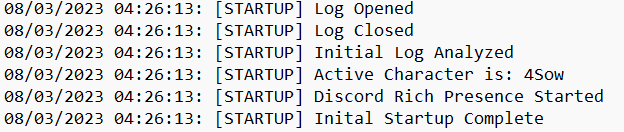

# EVE-Discord-Rich-Presence

Python Script for displaying EVE Discord Rich Presence

## Features
- [X]  Character Detection
- [X]  Corporation Config
- [X]  Mining and Combat Detection
- [X]  System Detection
- [X]  Automatic Shutdown
- [ ]  Game/Log Startup Detection
- [ ]  Pull Character Information from EVE API

## Screenshots




## Installation
1. Install the required libraries using `pip install -r requirements.txt` inside the program folder
2. Download the [**Newest Release**](https://github.com/ianli0122/EVE-Discord-Rich-Presence/releases)
3. Edit **config.json**
```
{
    "user": "{Insert Username}",
    "lastSystem": "{Insert Last System}",
    "alliance": "{Insert Alliance (See Below)}",
    "delay": 15
}
```
(Recommended delay time is 15 seconds)

## Usage
1. Launch Discord and EVE
2. Fully log in on EVE and select your character
3. Launch the script and enjoy!

When EVE or Discord is closed, the script will detect it and shutdown automatically.

## Availiable Alliances
|Alliances|ID|
|-------|-------|
|Amarr|amarr|
|Caldari|caldari|
|Gallente|gallente|
|Minmatar|minmatar|
|Azure Citizen|azure_citizen|
|Brave Collective|brave_collective|
|Brave United|brave_united|
|Dracarys|dracarys|
|Fraternity|fraternity|
|Fraternity University|fraternity_university|
|Goonswarm Federation|goonswarm_federation|
|Pandemic Horde|pandemic_horde|
|Silent Company|silent_company|
|The Initiative|the_initiative|
|WE FORM BL0B|we_form_bl0b|
|WE FORM V0LTA|we_form_v0lta\